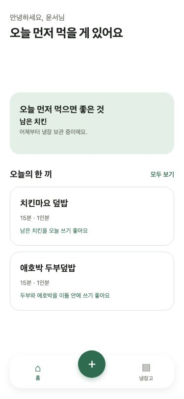
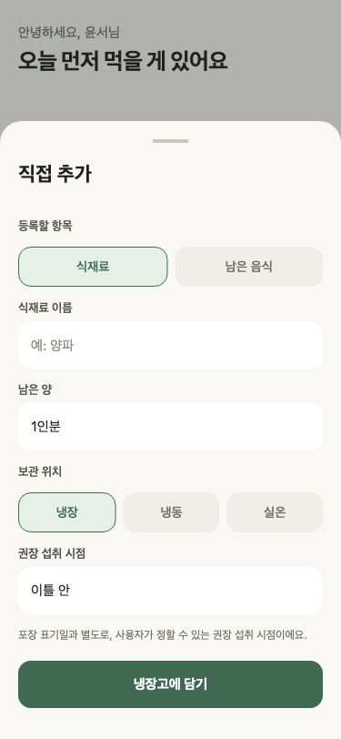
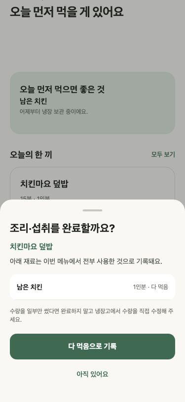
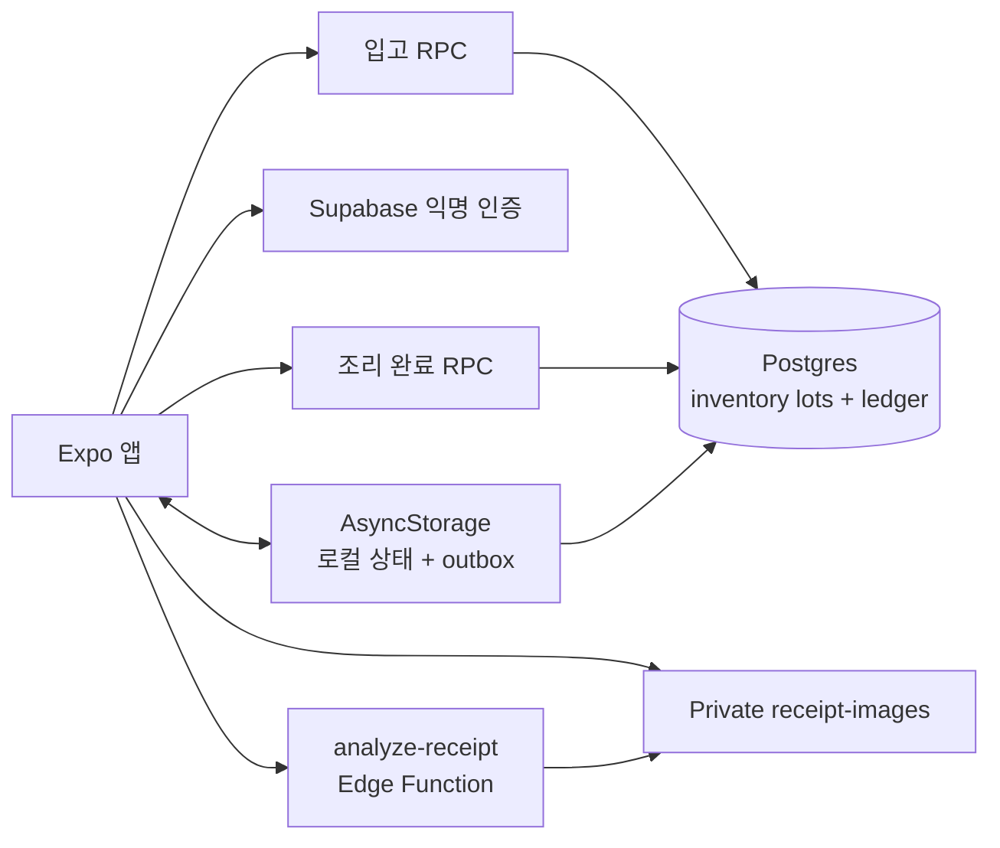

# 남김없이

> **장을 본 날의 기록을, 오늘 먹을 한 끼의 결정으로 바꾸는 앱.**<br />
> 1~2인 가구가 남은 음식과 임박 재료를 잊기 전에 쓰도록 돕는 모바일 포트폴리오 프로젝트입니다.

<p align="center">
  
</p>

## 냉장고를 정리하는 일보다, 오늘 뭘 먹을지가 더 어렵다

식재료 관리 앱은 보통 더 많은 목록과 더 정확한 날짜를 요구합니다. 하지만 1인 가구에게 재고 관리는 매일 유지하기 어려운 일이 됩니다.

남김없이는 질문을 바꿉니다.

```text
“냉장고에 뭐가 있지?”  →  “오늘 먼저 먹을 건 뭐지?”
```

그래서 이 앱은 재고를 많이 보여 주기보다 **지금 할 행동 하나**를 먼저 보여 줍니다. 영수증은 짧게 검수하고, 남은 음식은 생활 단위로 적고, 메뉴는 이유와 함께 세 개만 제안합니다.

## 데모에서 보여 주는 세 가지 결정

| 1. 기록할까? | 2. 무엇을 먼저 먹을까? | 3. 얼마나 남았을까? |
| --- | --- | --- |
| 영수증 결과를 확인·수정·제외한 뒤에만 입고합니다. | 임박 재료와 보유 재료를 점수화해 메뉴를 최대 세 개 제안합니다. | `다 먹음` 또는 `반 모`, `조금 남음`처럼 실제 남은 양을 사용자가 확인합니다. |
|  |  |  |

### 1) 영수증을 믿기 전에, 사용자가 검수한다

```text
사진 선택 → 품목 초안 → 확인 / 수정 / 제외 → 냉장고 입고
```

- 원문, 수량, 보관 위치, 권장 섭취 시점을 바로 고칠 수 있습니다.
- 낮은 신뢰도 항목은 `AI 추정 · 확인 필요`로 분리합니다.
- 사용자가 확정하기 전에는 재고와 원장이 바뀌지 않습니다.

### 2) 메뉴는 생성하지 않고, 재고를 근거로 고른다

```text
점수 = 재료 충족도 + 임박 재료 활용 − 부족 재료 − 조리 시간 페널티
```

추천은 자유형 AI가 아닙니다. 작은 한국어 레시피 카탈로그를 현재 재고와 결정론적으로 매칭합니다. 부족 재료가 두 개를 넘으면 제외하고, 메뉴 카드에는 부족 재료·예상 시간·추천 이유를 함께 보여 줍니다.

### 3) “썼다”가 아니라, 실제 남은 양을 기록한다

조리 완료 뒤 각 lot를 전량 소비하거나 일부만 사용했다고 확인합니다. `반 봉지`나 `1모`를 임의의 숫자로 바꾸지 않고, 사용자가 입력한 생활 단위를 다음 재고와 원장에 그대로 저장합니다.

## AI 신뢰 UX: 일부러 하지 않은 것

현재 영수증 분석은 실제 OCR provider를 연결하지 않은 **명시적 fixture**입니다. 앱은 이를 숨기거나 OCR 결과처럼 표현하지 않습니다.

```text
private 영수증 원본
      ↓  소유자 · MIME · 실제 바이트 수를 서버에서 재검증
fixture 초안  ──→  “분석 제공자는 아직 연결 전” 고지
      ↓  사용자 확인
재고 lot + intake 원장 확정
```

이 선택은 기능 부족을 감추지 않기 위한 것입니다. 이 프로젝트가 보여 주려는 것은 OCR 정확도보다 **AI가 틀릴 수 있을 때도 사용자가 통제권을 잃지 않는 제품 경험**입니다.

## 실제로 동작하는 범위

| 영역 | 구현 상태 |
| --- | --- |
| 재고 | 보관 위치 필터, 직접 추가·수정·제외, 남은 음식, 전량/부분 소비 |
| 동기화 | AsyncStorage 로컬 우선 저장, 영속 outbox, 실패·대기 표시와 재시도 |
| 백엔드 | 익명 인증, 사용자별 RLS, Postgres 재고·원장, private Storage, Edge Function |
| 입고 정합성 | 동일 영수증 재확정은 `already-confirmed`; lot와 입고 원장을 RPC로 함께 기록 |
| 조리 정합성 | 동일 조리 세션 재확정은 `already-confirmed`; 부분/전량 차감과 세션 감사를 한 트랜잭션으로 기록 |
| 추천 | 활성 재고 기반 최대 3개, 현재 데모용 레시피 5개 |

## 데이터가 어긋나지 않게 한 방법



- **입고**: `receipt_intakes(user_id, receipt_id)`를 먼저 선점해 재시도·동시 요청에도 한 번만 확정합니다.
- **차감**: `cooking_sessions(user_id, id)`를 선점해 같은 조리 세션이 두 번 차감되지 않게 합니다.
- **보안**: 이미지에는 public URL을 만들지 않고, 사용자 ID 경로와 RLS를 함께 검증합니다.
- **오프라인**: 로컬 재고와 outbox를 먼저 저장하므로 요청 실패가 기존 재고를 지우지 않습니다.

## 검증 기록

```bash
npm run lint
npm run test:domain
npx tsc --noEmit
npx expo export --platform web
```

위 검증과 함께 375 × 812 웹 QA에서 남은 음식 등록, 메뉴 추천, 부분·전량 차감, 앱 재시작 뒤 동기화 복원을 확인했습니다. 새 익명 사용자 Supabase E2E에서는 다음을 확인했습니다.

```text
private PNG 업로드
→ ready / fixture
→ 입고 confirmed
→ 같은 요청 재시도 already-confirmed
→ 인증 없는 public 원본 URL은 HTTP 400
```

## 로컬에서 실행하기

```bash
npm install
cp .env.example .env
npm run start
```

`.env`에는 익명 로그인이 활성화된 Supabase 프로젝트의 publishable 연결 정보가 필요합니다.

```dotenv
EXPO_PUBLIC_SUPABASE_URL=https://<project-ref>.supabase.co
EXPO_PUBLIC_SUPABASE_PUBLISHABLE_KEY=<publishable-key>
```

웹 실행은 `npm run web`을 사용합니다. 별도 Supabase 프로젝트에 연결하려면 [`supabase/migrations`](supabase/migrations)을 시간순으로 적용하고, [`analyze-receipt`](supabase/functions/analyze-receipt/index.ts) Edge Function을 배포해야 합니다. 서비스 역할 키와 OCR 키는 앱 환경 변수에 넣지 않습니다.

실기기에 로컬 Debug 앱을 설치하려면 Mac에 Xcode·CocoaPods와 Android SDK·JDK가 필요합니다. iPhone은 개발자 모드 및 개인 개발 서명, Android는 USB 디버깅 연결을 준비합니다.

```bash
npm run ios -- --device
npm run android -- --device
```

앱 식별자는 두 플랫폼 모두 `com.parkjsoo.namgimeopsi`입니다. 네이티브 프로젝트는 Expo가 생성하며 `ios/`, `android/`는 Git에서 제외합니다. JS 수정은 실행 중인 Metro로 반영되지만 네이티브 설정 변경은 재빌드해야 합니다. 이 Debug 실행은 Metro가 필요한 개발 환경이며, 독립 실행 가능한 preview build와 구분합니다.

## 다음 단계

- iOS·Android 실기기에서 사진 권한과 레이아웃을 검증하고 preview build 만들기
- [2분 데모 대본·케이스 스터디 초안](docs/08-portfolio-demo.md)을 바탕으로 촬영하기 (영상은 아직 미제작)
- 사용성 테스트로 검수 편집 비용과 추천 근거 다듬기

실제 OCR, 바코드 DB, 가족 공유, 자유형 AI 요리 챗, 영양·알레르기 분석은 이 MVP의 범위 밖입니다.

## 더 읽기

- [현재 상태와 인계](docs/00-current-context.md)
- [제품 브리프](docs/01-product-brief.md)
- [UX 명세](docs/02-ux-specification.md)
- [기술 설계](docs/03-technical-design.md)
- [개발 로드맵](docs/04-development-roadmap.md)
