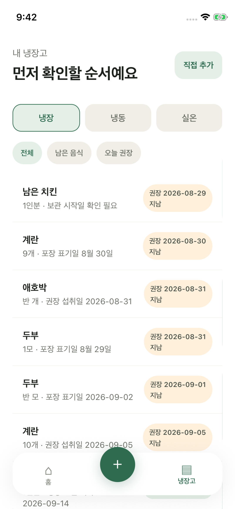
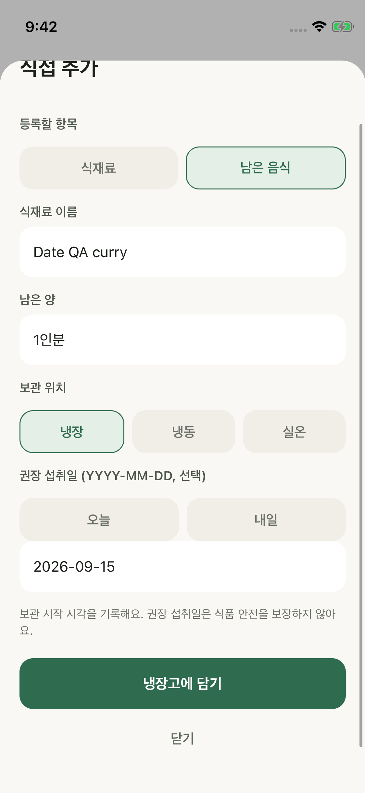

# 날짜 일관성 수정 QA — 2026-09-14

9월 9일 리허설에서 발견한 상대 문구와 실제 날짜의 불일치를 수정했다. 토큰 한도로 중단된 작업을 9월 14일 재개해 마무리했다.

## 구현

- 신규 남은 음식은 실제 권장일과 보관 시작 ISO 시각을 저장한다. 오늘/내일 선택과 선택적 YYYY-MM-DD 입력을 제공하며 존재하지 않는 날짜는 저장할 수 없다.
- 추가·수정·날짜 제거·동기화가 동일한 날짜 변환을 사용한다. 기존 남은 음식의 보관 시작은 수정으로 덮어쓰지 않는다.
- 목록, 홈 우선 재고, 결정론적 추천은 같은 날짜 상태를 사용한다. 현지 자정과 앱 복귀 시 기준일을 갱신한다.
- 권장일이 없으면 유효한 포장 표기일만 보조로 사용한다. 과거 상대 문구의 기준일을 추측하지 않는다. 지남은 섭취 안전 여부가 아니며 상태 확인 문구를 표시한다.

## 검증

- inventory hook 7개, 날짜 단위 8개, domain 14개, receipts·recipes, TypeScript, lint 통과. 날짜 편집·제거·outbox, 윤년·월말·연말·현지 자정·DST, 과거 문구·잘못된 날짜·목록/추천 일치 포함.
- 전용 Demo iPhone 13 mini / iOS 26.5 / Release에서 XCTest 실제 터치로 검증했다. 실기기에는 접근하지 않았다.
- 9월 14일 새 등록 기본일 2026-09-15 확인 → 2026-02-30 입력·버튼 비활성 확인 → 2026-09-15 저장 성공.
- 새 lot `inventory-1789375395676`의 `recommended_use_by_at=2026-09-15`, `storage_started_at=2026-09-14T08:43:15.676Z`를 인증된 REST 조회로 확인했다. 재실행 뒤 기존 11개와 새 1개 및 원장 7건의 내용 유지, outbox 0을 확인했다.
- 입력 자동화의 초기 실패는 필드 포커스·커서 위치·키보드 위 스와이프 좌표 문제였다. 실제 좌표 터치와 입력값 단언 후 성공했다. 실패 실행을 앱 저장 결함으로 집계하지 않는다.
- 최종 목록에서 날짜와 `지남`을 두 줄로 분리해 글자 중간 줄바꿈을 보정하고 새 Release 화면을 확인했다.
- 최종 JS 번들 SHA-256: `6d7f3bb0db2a5f0923be629337defb72771de40fd5281984a04507d23e7a0b2a`.
- 로컬 근거: `.expo/date-fix-qa/calendar-date-native3.xcresult`, `final-layout.xcresult`, `release-final.log`, `remote-saved.jsonl`; `.expo/demo-production/date-fixed-saved.json`, `date-fixed-restarted.json`.

## 승인된 테스트 재고 정리

사용자가 불필요한 데이터와 기존 QA 재고 삭제를 허용했다. 각 전용 시뮬레이터의 익명 인증 세션으로 자기 사용자 행만 조회·삭제했다. 전체 DB 초기화나 스키마 변경은 하지 않았다.

| 대상 | 삭제한 재고 | 삭제한 원장 | 재실행 후 서버 |
| --- | ---: | ---: | --- |
| Demo 시뮬레이터 | 12 | 7 | 모두 0 |
| 기존 QA 시뮬레이터 | 6 | 2 | 모두 0 |

각 앱을 종료한 상태에서 로컬 inventory v2와 outbox를 비우고 인증 세션은 유지했다. Demo는 새 Release의 빈 재고로 유지하고 QA 환경은 종료했다. scan job·receipt intake·cooking session 감사 이력과 증거 파일은 이력 추적을 위해 남겼다. 실기기·다른 사용자 재고는 작업 대상이 아니다.

전체 리허설은 9월 9일 완료했다. 날짜 수정 후 위 회귀를 수행했으며 전체 촬영을 다시 완료한 것은 아니다. 본촬영·최종 영상은 다음 단계다. 10초 smoke 영상은 최종 편집에 사용하지 않는다.
