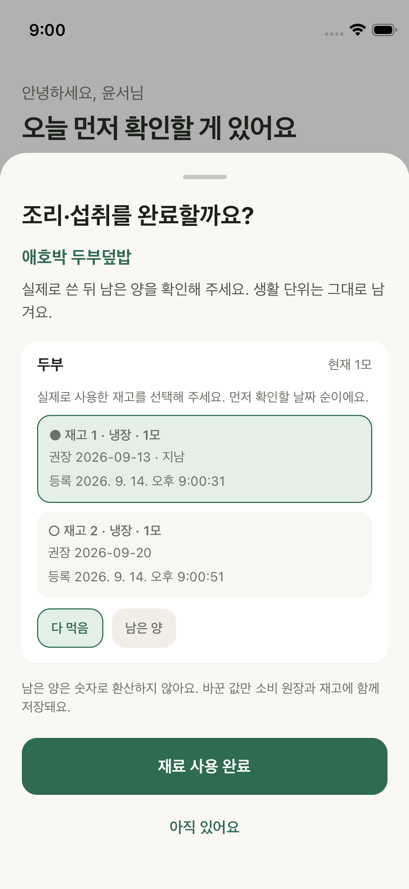
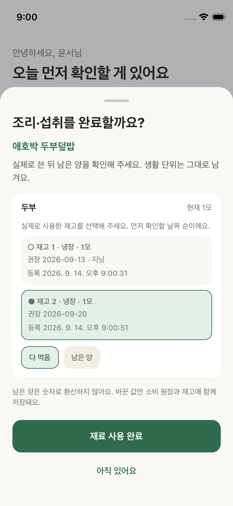
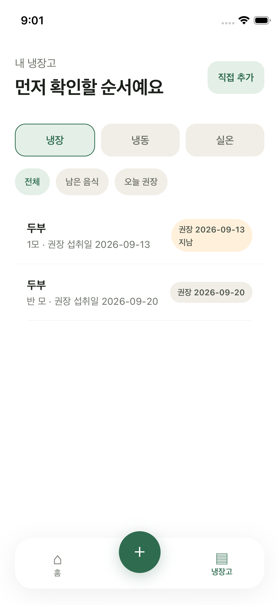

# 동명 재고 선택 수정·검증 — 2026-09-14

전문 리뷰의 P2인 추천 근거와 차감 대상 불일치를 수정했다. 같은 이름의 재고는 공통 날짜 우선순위(상태 → 실제 날짜 → 등록 시각 → ID)로 묶는다. 추천과 완료 시트 모두 같은 기본 lot를 사용한다.

## 동작

- 완료 시트에 동명 재고가 여러 개면 날짜·보관 위치·수량·등록 시각을 표시한다. 사용자가 실제로 사용한 재고를 선택하면 해당 ID만 부분/전량 차감한다.
- 기본 선택은 먼저 확인할 날짜 순이다. 기준 날짜 경과는 안전 판정이 아니며 `지남` 표시를 유지한다.
- 품목별로 한 lot를 선택하는 현재 흐름을 유지한다. 한 번의 조리에서 같은 품목의 여러 lot를 동시에 차감하는 기능은 추가하지 않았다.
- 선택하지 않은 lot는 수량과 원장이 바뀌지 않는다. 취소하면 선택·입력 초안을 초기화한다.

## 자동 검증

- 실제 완료 시트·추천·원장 함수를 연결해 새 두부 9/20이 배열 앞에 있어도 기존 두부 9/13이 기본 대상이 되는지 확인했다.
- 다른 lot 선택 → 반 모 입력 → 선택한 ID만 consume 이벤트·수량 갱신 확인.
- 날짜/보관 위치 구별 표시, 같은 이름 중복 후보 제거, 취소 후 기본 선택 복원과 재고 불변 확인.
- 기존 빈 잔량 전체 차감 차단, 미변경 lot 보존 테스트도 통과했다. recipes 6개 시나리오, inventory 8 + 날짜/추천 9, domain 14, TypeScript·lint 통과.

## 네이티브 검증

기존 QA 전용 iPhone 13 mini / iOS 26.5 / UDID `6B38D865-7C34-45E2-9A8E-D425754394D9`의 빈 재고에서 수행했다. 실기기는 사용하지 않았다. 본촬영 Demo 데이터와 분리했다.

1. 두부 1모 / 9월 13일, 두부 1모 / 9월 20일을 실제 한글 키보드로 순서대로 등록했다. 최근 lot가 원본 배열 앞에 놓이는 재현 조건이다.
2. 추천에서 날짜 경과 안내 확인, 완료 시트에서 9/13 lot 기본 선택을 화면으로 확인했다.
3. 9/20 lot를 터치해 선택하고 반 모를 입력·확정했다. XCTest는 성공했다.
4. 인증된 자기 사용자 서버 조회에서 기존 `inventory-1789387231986`은 1모, 선택한 `inventory-1789387251001`은 반 모임을 확인했다. 재실행 캐시에 선택 ID의 부분 소비 이벤트 1건과 outbox 0을 확인했다.
5. 기존 사용자 정리 승인에 따라 새 QA 재고 2개·원장 1건과 로컬 캐시를 정리했다. 재실행 뒤 서버 0건 확인 후 QA 시뮬레이터를 종료했다.

## 설치와 영상 구분

최종 simulator Release 번들 SHA-256은 `d2c8daab5e1f54e6a663e23629db30454a2d64df32a570e61c22c38427b8e8b1`이다. QA 검증 뒤 Demo에도 갱신 설치했고 본촬영 재고·원장·outbox가 이전 snapshot과 그대로 일치했다(6 stored / 5 active / 7 events / outbox 0).

기존 120초 영상은 `454ac3a`의 단일 lot 흐름을 촬영한 기록이다. 이번 선택 UI를 영상에 추가했다고 표현하지 않는다. 영상 파일과 해시는 변경하지 않았다. 실기기 설치·push·외부 공개도 하지 않았다.

로컬 근거: `.expo/lot-selection-qa/duplicate-lots.xcresult`, `remote-after.jsonl`, `saved.json`, `restarted.json`, `cleanup-result.jsonl`; 빌드 로그 `.expo/date-fix-qa/lot-selection-build.log`.
